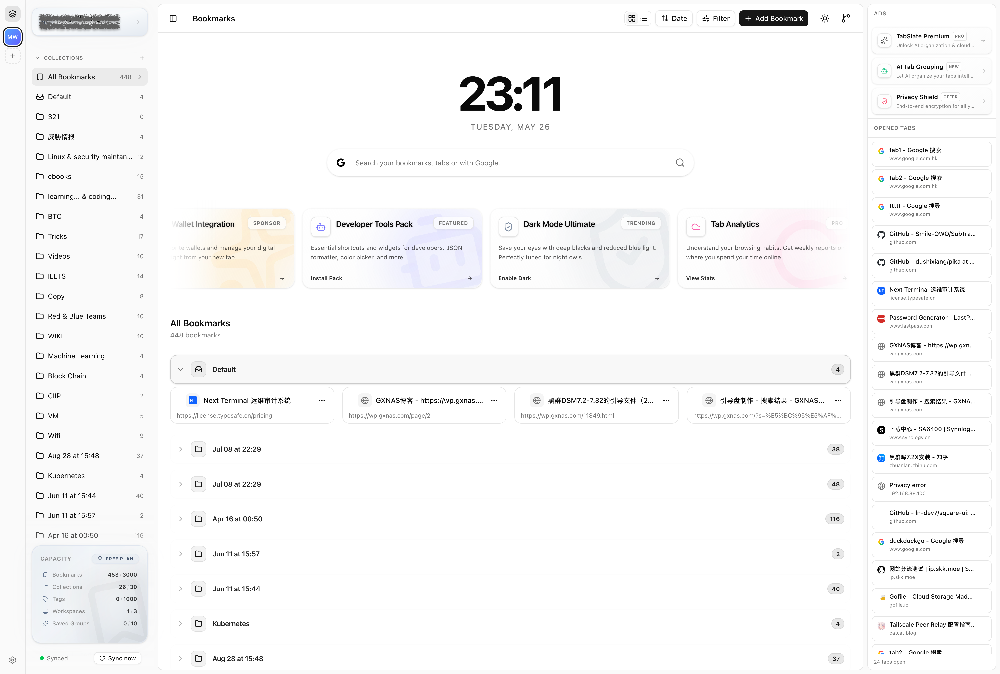

<div align="center">
  
  <h1>TabSlate ✨</h1>
  <p>
    一款现代化的 Chrome 浏览器新标签页替换扩展。<br>
    提供高级标签页管理、可视化的书签整理，以及工作区分组功能。<br>
    <b>重新夺回你的浏览器标签页与书签的掌控权。</b><br><br>
    <i><a href="https://www.gettoby.com/">Toby</a> 与 <a href="https://workona.com/">Workona</a> 的开源替代方案。</i>
  </p>
  
  <p>
    
    
  </p>
  <p>
    
    
    
  </p>
</div>

<p align="center">
  <a href="../README.md">English</a> •
  <a href="./README_ZH.md">简体中文</a>
</p>

---

## 👋 为什么选择 TabSlate?

你是否经常沉没在几十个打开的标签页中？你的书签栏是否混乱不堪、无处安放？

这正是我们打造 **TabSlate** 的原因。作为 [Toby](https://www.gettoby.com/) 和 [Workona](https://workona.com/) 的开源替代方案，它能将浏览器默认的“新标签页”替换为一个强大、整洁且美观的控制台。无论你是需要同时处理多个项目的高级用户、需要保存大量参考资料的研究人员，还是仅仅想要一个干净浏览体验的普通用户，TabSlate 都能帮你将一切打理得井井有条，触手可及。

---

## ✨ 核心功能

### 🌌 核心机制

- **🗂️ 工作区与书签集 (Workspaces & Collections)**: 将你的浏览上下文组织到专用的工作区与多层级的书签集中。
- **🔖 可视化书签**: 美观的网格化书签管理器，支持自动获取网页图标 (Favicon) 及丰富的元数据。
- **🔍 全局搜索面板**: 随时随地按下 `Ctrl+K` (或 `Cmd+K`) 唤出强大的命令面板。可以瞬间检索所有已打开的标签页、书签和分类，或回退至默认搜索引擎进行搜索。
- **☁️ 云端同步**: 通过自托管的 `TabSlate-server` 或官方云服务，跨设备保持数据同步。
- **🗑️ 回收站恢复**: 误删了书签？可以轻松从内置的回收站中将它们恢复。

### 📑 高级标签页管理

- **📍 标签页总览**: 直接在“新标签页”中查看并管理当前所有打开的标签页。
- **📦 Chrome 原生标签组同步**: 与 Chrome 浏览器的标签组 (Tab Groups) 深度集成。可持久化保存标签组，并支持一键恢复。
- **🤏 紧凑型标题**: 为标签组开启紧凑命名模式，大幅节省标签栏的宝贵空间。
- **🚫 重复检测**: 内置提示功能，防止你重复打开同一个标签页。

### 🎨 设计与个性化

- **🌙 深色模式**: 基于 Tailwind CSS 和 `shadcn/ui` 构建，支持优雅的深/浅色模式以及平滑过渡。
- **🌐 多语言支持 (i18n)**: 原生支持本地化（目前支持英文与简体中文）。
- **🎨 自定义视觉**: 可以为标签组和书签分类分配不同的颜色，让界面更加直观清晰。

---

## 📥 安装

<div align="center">
  <a href="https://chromewebstore.google.com/detail/hjopekcfkkiphbbdjccdhhlldnnfbchm" target="_blank">
    
  </a>
</div>

> **注意:** TabSlate 目前正处于活跃开发阶段。

### 手动安装 (开发者模式)

1. 克隆本仓库或下载最新 Release 源码：
   ```bash
   git clone https://github.com/TabSlate/TabSlate.git
   cd TabSlate
   ```
2. 安装依赖项 (推荐使用 Bun):
   ```bash
   bun install
   ```
3. 构建扩展产物：
   ```bash
   bun run build
   ```
4. 打开 Chrome 并导航至 `chrome://extensions/`。
5. 开启右上角的 **"开发者模式"**。
6. 点击 **"加载已解压的扩展程序"**，然后选择项目目录下的 `.output/chrome-mv3` 文件夹。

---

## 🛠️ 开发指南

我们非常欢迎任何形式的贡献！

### 常用命令

- `bun run dev` - 启动开发模式（支持热重载）。
- `bun run build` - 构建生产环境扩展产物。
- `bun run compile` - 运行 TypeScript 类型检查。
- `bun run zip` - 打包生成 `.zip` 文件以供上传至 Chrome Web Store。

*有关详细的技术架构与状态管理文档，请参阅 `ARCHITECTURE.md`。*

---

## 📄 开源协议

TabSlate 采用 **GNU Affero General Public License v3.0 (AGPL-3.0)** 协议开源 - 详情请参阅 [LICENSE](../LICENSE) 文件。

### ⚠️ 商业使用限制

**请注意:** 本项目仅供个人和非商业用途使用。**严格禁止任何形式的商业使用。** 未经作者事先书面许可，您不得将本软件或其任何衍生作品用于商业目的的复制、分发或变现。

---

<div align="center">
  <p>用心制造 ❤️ 带来更好的浏览体验。</p>
</div>
