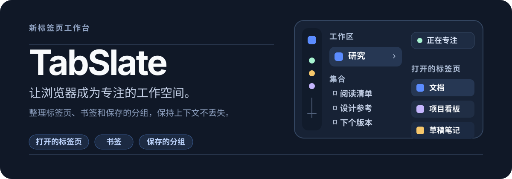
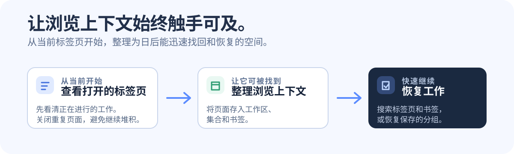

<p align="center">
  
</p>

<p align="center">
  一款 Chrome 扩展，将新标签页变成平静、可搜索的浏览工作空间。
</p>

<p align="center">
  <a href="https://tabslate.com"></a>
  <a href="https://chromewebstore.google.com/detail/hjopekcfkkiphbbdjccdhhlldnnfbchm"></a>
  
  <a href="https://github.com/TabSlate-dev/TabSlate/stargazers"></a>
  <a href="../LICENSE"></a>
</p>

<p align="center">
  <a href="../README.md">English</a> · <a href="./README_ZH.md">简体中文</a>
</p>

## 不止看到当前标签页，也看清整个浏览上下文


TabSlate 用一个新标签页工作空间替代浏览器默认页，让浏览上下文保持完整：先查看正在打开的内容，收集值得回访的页面，再在项目回归时恢复保存的标签组。

它是 [Toby](https://www.gettoby.com/) 与 [Workona](https://www.workona.com/) 的开源替代方案。

## 围绕浏览上下文构建

### 整理每一项浏览工作

- 为不同项目、研究主题或日常场景创建工作区与集合。
- 用带网页图标和元数据的可视化书签保存页面，不再让有价值的链接消失在标签栏里。
- 将 Chrome 原生标签组保存为可复用的分组，需要时一键恢复。

### 不离开当前位置，也能找到所需内容

- 从新标签页搜索打开的标签页、书签和已启用的搜索引擎。
- Windows 和 Linux 使用 `Ctrl+Shift+K`，macOS 使用 `Command+Shift+K` 打开全局搜索浮层。
- 当集合逐渐增长时，用排序、筛选、网格或列表视图继续管理。

### 可恢复、可继续，也始终可控

- 在再次打开之前发现重复标签页。
- 归档内容，或将误删项目移入回收站，并在需要时恢复。
- 通过自托管 TabSlate server 或官方云服务，在需要时跨设备同步工作空间。

<p align="center">
  
</p>

## 安装 TabSlate

### Chrome Web Store

从 [Chrome Web Store 安装 TabSlate](https://chromewebstore.google.com/detail/hjopekcfkkiphbbdjccdhhlldnnfbchm)，然后打开一个新标签页即可开始整理。

### 从源码安装

```bash
git clone https://github.com/TabSlate-dev/TabSlate.git
cd TabSlate
bun install
bun run build
```

接着打开 `chrome://extensions/`，启用 **开发者模式**，点击 **加载已解压的扩展程序**，并选择 `.output/chrome-mv3`。

## 开发

TabSlate 是基于 WXT、React、TypeScript、Zustand、Tailwind CSS 和 shadcn/ui 构建的 Chrome MV3 扩展。先安装 [Bun](https://bun.sh/)，再按需运行：

```bash
# 热重载开发模式
bun run dev

# 不创建构建产物的类型检查
bun run compile

# 构建生产扩展
bun run build

# 打包用于上传 Chrome Web Store 的压缩包
bun run zip
```

扩展包含独立的新标签页、popup、后台 Service Worker 和内容脚本入口。数据模型、消息流和代码结构请参阅 [ARCHITECTURE.md](../ARCHITECTURE.md)。

## 贡献

欢迎提交 Issue 和 Pull Request。提交前请运行：

```bash
bun run compile
bun run build
```

如果修改会影响用户可见行为，请在同一个 Pull Request 中同步更新 README 相关部分或架构文档。

## 许可证

TabSlate 采用 [GNU Affero General Public License v3.0](../LICENSE) 开源。
