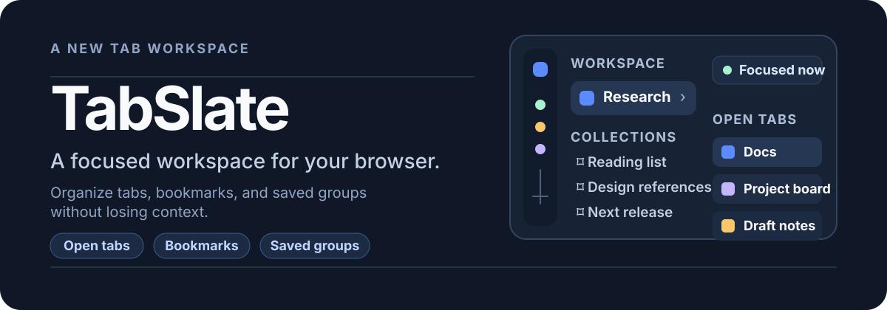
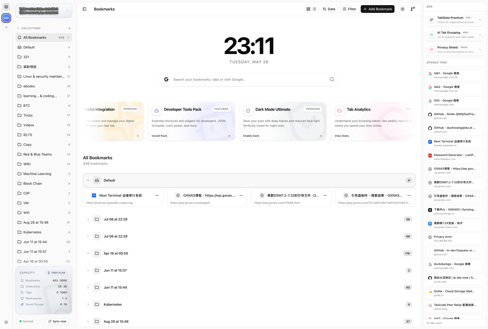
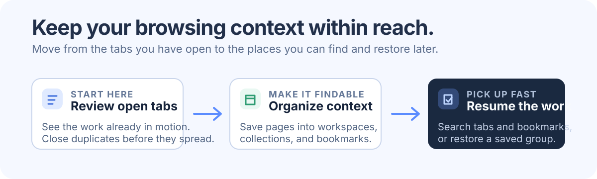

<p align="center">
  
</p>

<p align="center">
  A Chrome extension that turns your new tab into a calm, searchable workspace for everything you are browsing.
</p>

<p align="center">
  <a href="https://tabslate.com"></a>
  <a href="https://chromewebstore.google.com/detail/hjopekcfkkiphbbdjccdhhlldnnfbchm"></a>
  
  <a href="https://github.com/TabSlate-dev/TabSlate/stargazers"></a>
  <a href="./LICENSE"></a>
</p>

<p align="center">
  <a href="./README.md">English</a> · <a href="./.github/README_ZH.md">简体中文</a>
</p>

## See the whole browser, not just the current tab



TabSlate replaces the default new-tab page with one place to keep browsing context intact. Review what is open, collect pages worth returning to, and resume saved tab groups when a project comes back around.

It is an open-source alternative to [Toby](https://www.gettoby.com/) and [Workona](https://www.workona.com/).

## Built around browsing context

### Organize the work behind your tabs

- Create workspaces and collections for different projects, areas of research, or parts of your day.
- Save pages as visual bookmarks with favicons and metadata instead of letting useful links disappear into the tab bar.
- Keep Chrome tab groups as reusable saved groups, ready to restore in one action.

### Find the right thing without losing your place

- Search open tabs, bookmarks, and enabled search engines from the new tab.
- Open the global search overlay with `Ctrl+Shift+K` on Windows and Linux, or `Command+Shift+K` on macOS.
- Sort, filter, and work in grid or list views when a collection grows.

### Recover, continue, and stay in control

- Catch duplicate tabs before opening another copy.
- Archive or move accidental deletions to Trash, then restore them when needed.
- Sync through a self-hosted TabSlate server or the official cloud service when you want your workspace on more than one device.

<p align="center">
  
</p>

## Install TabSlate

### Chrome Web Store

Install [TabSlate from the Chrome Web Store](https://chromewebstore.google.com/detail/hjopekcfkkiphbbdjccdhhlldnnfbchm), then open a new tab to start organizing.

### From source

```bash
git clone https://github.com/TabSlate-dev/TabSlate.git
cd TabSlate
bun install
bun run build
```

Then open `chrome://extensions`, enable **Developer mode**, choose **Load unpacked**, and select `.output/chrome-mv3`.

## Develop

TabSlate is a React and TypeScript Chrome MV3 extension built with WXT, Zustand, Tailwind CSS, and shadcn/ui. Install [Bun](https://bun.sh/) first, then use the commands that fit the task:

```bash
# Develop with hot reload
bun run dev

# Type-check without creating build output
bun run compile

# Build the production extension
bun run build

# Package a Chrome Web Store upload
bun run zip
```

The extension has separate new-tab, popup, background-service-worker, and content-script entry points. See [ARCHITECTURE.md](./ARCHITECTURE.md) for the data model, message flows, and codebase map.

## Contribute

Issues and pull requests are welcome. Before opening a change, run:

```bash
bun run compile
bun run build
```

If your change affects user-visible behavior, update the relevant README section or architecture documentation in the same pull request.

## License

TabSlate is licensed under the [GNU Affero General Public License v3.0](./LICENSE).
